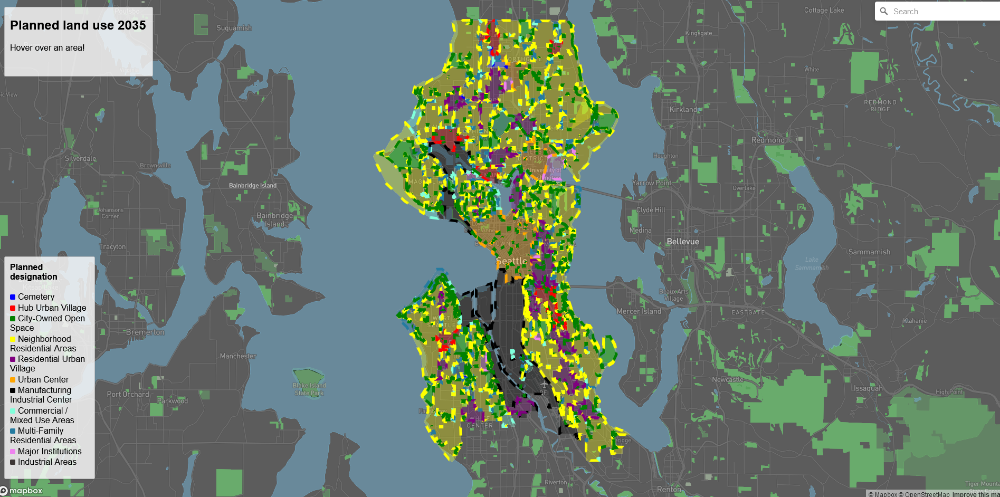
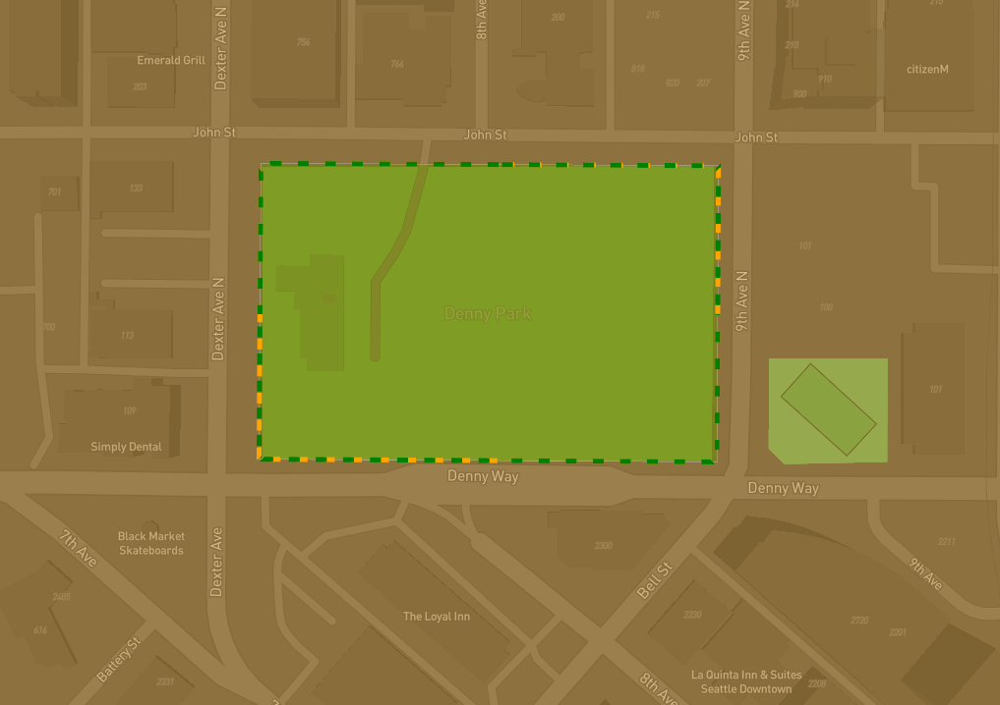
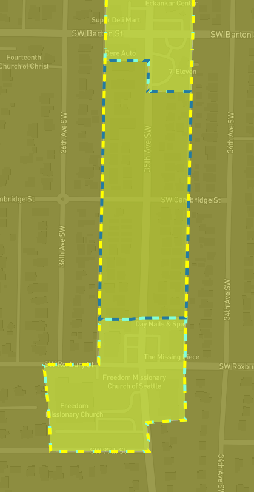
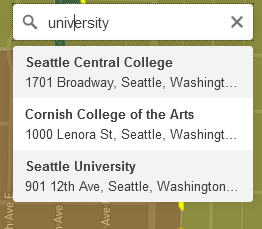
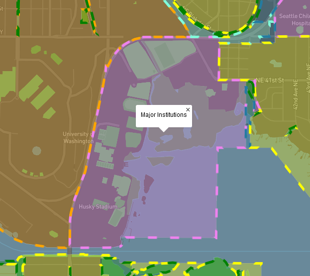
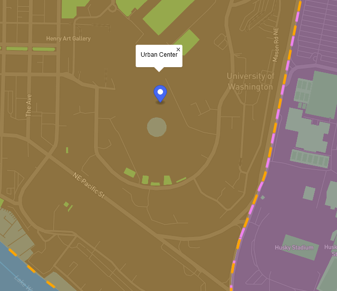

 # Future land use of Seattle for 2035
## Project description
For my GEOG 495 final project I built a webGIS application that shows users the future land use plans of Seattle that are planned for 2035 visualized as polygons with different colors for different governmental zoning designations. Some areas are colored incorrectly on the fill layer because some areas have multiple designations, so it is best to rely on the layer with colored borders for zones in determining a zoning designation of an area. The zoning designations for respective areas can be determined by looking at the color key on the left side of the screen.There are a few ways to determine an area’s zoning designation. One way is to hover your mouse cursor over areas of interest and check the box in the top left for an answer in a textbox. Another is to click on a zone and look for the textbox that pops up above where your cursor just clicked. To remove this textbox either click the ‘X’ in the top right or click on an area of the map where there is no data (i.e., no colored polygon). There are also a couple methods for identifying designation by color. One way is to look at an area’s color and match that to the color key on the left. However, this is not a sure-fire way to do this because colors are plotted with a degree of opacity and don’t match the color key’s colors. The  Although It’s close to the actual color and most people should be able to determine single designation zones through the fill color matching method relatively easily.  The bigger issue is when areas have multiple designations. With these zones the fill color becomes a blended wrong color because in these instances there are multiple different colored layers with opacity stacked on top of each other. To deal with this there is also a layer that shows colored and dashed borders for each area and the colors are the same as the color key’s colors for each respective zoning designation. This is useful for seeing the main zoning designation of areas and the sub designations for these areas. To see what zoning designation a location of interest falls under simply search the address in the search bar in the top right corner and click on one of the that search results comes up under search bar. Selecting an address like this will drop a pin of this location on the top layer of the map and move your screen view to that location. To remove this pin simply click the ‘X’ on the far-right side of the search bar in the top left. One note is that you can only drop pins on locations in Seattle and the search bar will only give results for addresses in Seattle.
## Project goal
The goal of my project is to show people how Seattle is changing over the next few years and to help them visualize those change more clearly. But I also wanted to allow people to see for themselves what might be happening to locations they are fond of/familiar with. For example, some parks are being removed or reduced in size to make space for more housing. I also thought it would be interesting to show people to see how Seattle is divided up in terms of governmental land designations. For me, it was interesting and surprising to see how much land in Seattle is dedicated for neighborhood residential areas and other types of housing.
## Functionality
- ## map.on('load', function loadingData()
    This functions loads up the layers of the map and adds all the map functionality to the webpage
- ## map.on('mousemove', ({point}) =>
    This function is resposible for updating the textbox in the top left with the zone designation for the respective area being hovered over. When an area with no data is being hovered over the textbox displays 'Hover over an area!'
- ## map.on('click', 'seattleData-layer2', function (e)
    This function is responsible for creating the textbox with zone designation information that pops up above cursor clicks when a user clicks on a designated zone
## Picturess of my Project
### Overview

### Normal zone bordering example

### Multiple zone designation example

### Search bar

### Example of clicking

### Example of searching up a location

## Link to my Application
[Future Seattle Zoning Plans 2035](https://yodapancake.github.io/geog495_finalproject/)

## Data Source
[Seattle GeoData](https://data-seattlecitygis.opendata.arcgis.com/datasets/SeattleCityGIS::future-land-use-2035/about)

## Acknowledgements
I would like to acknowledge Professor Zhao for being genuienly passionate and for teaching a wonderful course this quarter filled with useful learning

I would also like to acknowledge mapbox for offering a free version of their services and also providng fantastic documentation to their api

And finally, I would like to acknowledge the city of Seattle for maintaining and providing such a wide variety of datasets on the city to the public for someone like to create a webGIS application for example.  

## Applied Libraries
* [MapBox](https://www.mapbox.com/)
* [Mapbox GL JS](https://docs.mapbox.com/mapbox-gl-js/api/)
* [Mapbox GL JS Geocoder](https://api.mapbox.com/mapbox-gl-js/plugins/mapbox-gl-geocoder/v4.7.2/mapbox-gl-geocoder.min.js)
* The project is also published on [Github](https://github.com/)
